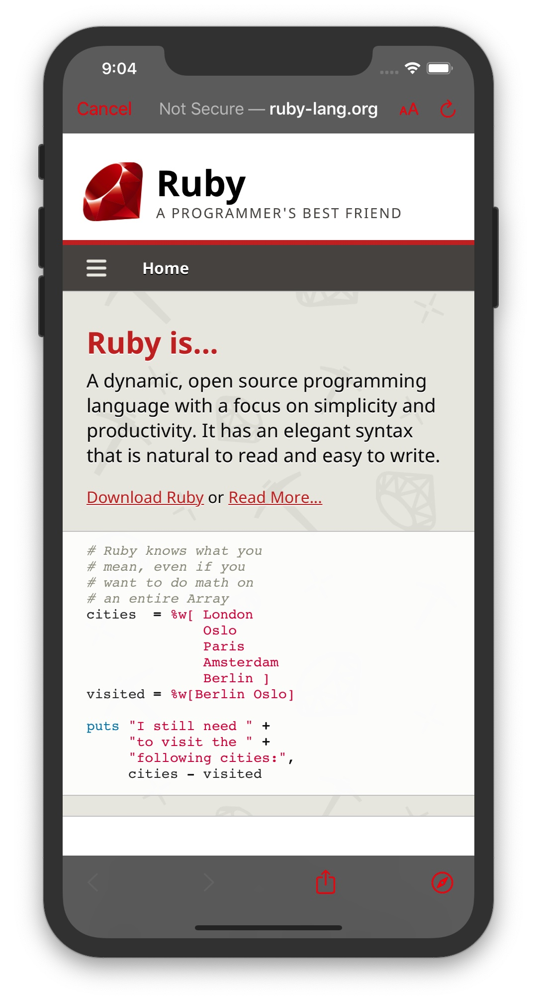

来自**Programming iOS 13 - Chapter 11: Web View**，相关文章：

- [the ultimate guide to wkwebview - hackingwithswift](https://www.hackingwithswift.com/articles/112/the-ultimate-guide-to-wkwebview)

github项目：

1. [WKWebViewDemo](https://github.com/jamessawyer/learn_ios/tree/master/Book_Programing_iOS13/chapter11%20WKWebView/WKWebViewDemo)
   1. 加载web view 的4种方式
   2. **`WKWebView`** 的 `title & isLoading` 属性的KVO的用法，如何在加载网页过程中，添加loading
   3. **`WKNavigationDelegate`** 相关方法的用法
   4. **`WKNavigationType & WKNavigationAction & WKNavigationActionPolicy`** 的信息
   5. **`SFSafariViewController`** 的用法
2. [ComunicatingIntoWebPage](https://github.com/jamessawyer/learn_ios/tree/master/Book_Programing_iOS13/chapter11%20WKWebView/CommunicatingIntoWebPage) 原生向web view 添加自定义脚本
   1. **`WKUserContentController`** 类，添加移除js脚本相关的方法
   2. **`WKUserScript`**  自定义js字符串
   3. **`WKWebView`** 的 **`evaluateJavaScript`** 方法，执行脚本
3. [WebViewPostMessage](https://github.com/jamessawyer/learn_ios/tree/master/Book_Programing_iOS13/chapter11%20WKWebView/WebViewPostMessage) web view 向原生发送消息
   1. **`WKScriptMessageHanlder`** 协议的使用
   2. 更多 关于 **`WkWebView`** 属性的设置
   3. **`window.webkit.messageHandlers.<swift注册交互名>.postMessage(传递给swift的参数)`**
   4. 使用委托的方式，避免内存泄漏


## 1. WKWebView

**`WKWebView`** 是 `WebKit` 框架的一部分（**`import WebKit`**）,它有一个指定构造器：

```swift
open class WKWebView: UIView {
  public init(frame: CGRect, configuration: WKWebViewConfiguration)
  public init?(coder: NSCoder)
}
```

使用：

```swift
let configuration = WKWebViewConfiguration()
// 配置 configuration 的一些属性
let wv = WKWebView(frame: someRect, configuration: configuration)
```

下面介绍一下 **`WKWebViewConfiguration`** 可以配置的一些属性

```swift
open class WKWebView: UIView {
  // 对configuration的拷贝
  @NSCopying open var configuration: WKWebViewConfiguration { get }
}
```

### 1.1 WKWebViewConfiguration

其部分定义如下：

```swift
open class WKWebViewConfiguration: NSObject, NSSecureCoding, NSCopying {
	// 是否要等所有资源都加载完成了 才显示网页
	// 默认是 false
	open var suppressesIncrementalRendering: Bool
	
	// 是否使用网页自带的HTML5视频播放器（true） 还是使用原生的全屏视频播放器（false）
	// 默认是 false  即使用原生的全屏播放器
	open var allowsInlineMediaPlayback: Bool
	
	// 需要用户点击才播放的媒体类型
	// WKAudivisualMediaTypes 是一个结构体 包含3个静态属性(底下会给出定义)
	// .audio | .video | .all
	@available(iOS 10.0, *)
	open var mediaTYpesRequiringUSerActionForPlayback: WKAudivisualMediaTypes
	
	// 使用允许html5视频 使用画中画的播放
	// 默认是 true
	open var allowsPictureInPictureMediaPlayback: Bool
	
	// 想要检测的数据类型 比如检测电话号码 会自动给网页中的电话号码加上链接 点击时自动打开电话
	// WKDataDetectorTypes 是一个枚举类型 有多种检测类型
	// 默认是 WKDataDetectorTypeNone 即不进行数据类型检测
	@available(iOS 10.0, *)
	open var dataDetectorTypes: WKDataDetectorTypes
	
	// 可用于控制网页中存储的资源
	// WKWebsiteDataStore 包含多个属性
	// 其中 httpCookieStore 可以用于检测，添加或者移除网页中的cookies
	open var websiteDataStore: WKWebsiteDataStore
	
	// 用于定义一些页面设置
	// WKPreferences包含以下一些属性
	//   minimumFontSize： 最小字号 默认是0pt
	//   javaScirptEnabled: 是否允许加载js 默认是 true
	//   javascriptCanOpenWindowsAutomatically: 是否在用户未操作的情况下打开其它窗口 默认 false
	//   isFraudulentWebsiteWarningEnabled: (iOS13+) 是否开启欺诈网站警告 默认 true(当前只在中国地区有效)
	open var preferences: WKPreferences
	
	// 这个比较重要 用户网页和iOS之间的交互通讯！！！
	// WKUserContentController 有多个和js脚本进行通信的方法
	open var userContentController: WKUserContentController
}

@available(iOS 10.0, *)
struct WKAudivisualMediaTypes: OptionSet {
  public init(rawValue: UInt)
  
  public static var audio: WKAudivisualMediaTypes { get }
  public static var video: WKAudivisualMediaTypes { get }
  public static var all: WKAudivisualMediaTypes { get }
}
```

WKWebView 不是一个滚动视图，但是它拥有一个滚动视图（**`scrollView`**）

- 可用于编程性的滚动视图
- 响应用户滚动
- 获取滚动视图的手势识别器，并且添加自己的手势识别器

```swift
open class WKWebView: UIView {
	// The scroll view associated with the web view.
  open var scrollView: UIScrollView { get }
}
```

另外，网页内容可以调用 **`takeSnapshot(with:completionHandler:)`** 进行快照，得到的图片可以作为 `UIImage` 在 `completionHandler` 中使用。

```swift
open class WKWebView: UIView {
  @available(iOS 11.0, *)
  open func takeSnapshot(with snapshotConfiguration: WKSnapshotConfiguration?, completionHandler: @escaping (UIImage?, Error?) -> Void) 
}
```


如果使用Storyboard添加 WKWebView 对象，需要在app target的 **`Link Binary with Libraries bild phase`**中 **手动添加 WebKit 框架，避免应用崩溃**。


### 1.2 网页内容（Web View Content）

有以下4种方式提供web view 内容,四种方式都返回 **`WKNavigation`** 对象，可用于操作webview导航相关的接口。

```swift
open class WKWebView: UIView {
  func load(_ request: URLRequest) -> WKNavigation?
  func loadFileURL(_ URL: URL, allowingReadAccessTo readAccessURL: URL) -> WKNavigation?
  func loadHTMLString(_ string: String, baseURL: URL?) -> WKNavigation?
  func load(_ data: Data, mimeType MIMEType: String, characterEncodingName: String, baseURL: URL) -> WKNavigation?
}
```

> **1. URLRequest**

使用 `URLRequest` 请求ur, 然后使用 WKWebView 的 **`load(_:)`** 加载页面，URLRequest构造器：

- **`URLRequest(url:cachePolicy:timeoutInterval:)`**: `cachePolicy & timeoutInterval` 都是可选参数

```swift
override func viewDidLoad() {
  super.viewDidLoad()
  
  let statusBarHeight = UIApplication.shared.statusBarFrame.height
  
  let configuration = WKWebViewConfiguration()
  // 可以配置上面提到的属性
  let wv = WKWebView(
  	frame: CGRect(
  		x: 0,
  		y: statusBarHeight,
  		width: UIScreen.main.bounds.width,
  		height: UIScreen.main.bounds.height - statusBarHeight
  	),
  	configuration: configuration
  )
  view.addSubview(wv)
  
  let url = URL(string: "https://www.youtube.com")!
  let req = URLRequest(url: url, cachePolicy: .reloadIgnoringCacheData, timeoutInterval: 10)
  wv.load(req)
}
```


> **2. 加载本地文件（a local file）**

先获取本地文件的URL，然后使用 **`loadFileUrl(_:allowingReadAccessTo:)`**， 其中 `allowingReadAccessTo` 参数有效的将web view 沙盒化到单个文件或目录中。

```swift
// 假设本地有个 home.html 文件
override func viewDidLoad() {
  super.viewDidLoad()
  
  let statusBarHeight = UIApplication.shared.statusBarFrame.height
  
  let configuration = WKWebViewConfiguration()
  // 可以配置上面提到的属性
  let wv = WKWebView(
  	frame: CGRect(
  		x: 0,
  		y: statusBarHeight,
  		width: UIScreen.main.bounds.width,
  		height: UIScreen.main.bounds.height - statusBarHeight
  	),
  	configuration: configuration
  )
  view.addSubview(wv)
  
  let url = Bundle.main.url(forResource: "home", ofExtension: "html")!
  wv.loadFileURL(url, allowingReadAccessTo: url)
}
```


> **3.加载HTML字符串（An HTML string）**

这个和上面的类似，只不过获取的是html相关的字符串，调用 **`loadHTMLString(_:baseURL:)`**,其中 `baseURL` 表示可以取出部分的HTML进行渲染，这对自定义网页内容十分的有用。

```swift
// 假设html内容存放在本地的 templateHTML.txt 文件中
// 先取出文件路径 然后读取文件内容 将其转换为字符串
override func viewDidLoad() {
  super.viewDidLoad()
  
  let statusBarHeight = UIApplication.shared.statusBarFrame.height
  
  let configuration = WKWebViewConfiguration()
  // 可以配置上面提到的属性
  let wv = WKWebView(
  	frame: CGRect(
  		x: 0,
  		y: statusBarHeight,
  		width: UIScreen.main.bounds.width,
  		height: UIScreen.main.bounds.height - statusBarHeight
  	),
  	configuration: configuration
  )
  view.addSubview(wv)
  
  let templatepath = Bundle.main.path(forResource: "templateHTML", ofType: "txt")!
  let base = URL(fileURLWithPath: templatepath)
  var s = try! String(contentsOfFile: templatepath)
  let ss = // 自定义html内容
  s = s.replacingOccurrences(of: "<content>", with: ss) // 进行替换
  wv.loadHTMLString(s, baseURL: base)
}
```


> **4.加载Data对象**

调用 **`load(_:MIMEType:characterEncodingName:baseURL:)`**,一般用于处理从网上加载的内容，其中的参数对应 **`URLResponse`** 的属性：

```swift
// 假设html内容存放在本地的 templateHTML.txt 文件中
// 先取出文件路径 然后读取文件内容 将其转换为字符串
override func viewDidLoad() {
  super.viewDidLoad()
  
  let statusBarHeight = UIApplication.shared.statusBarFrame.height
  
  let configuration = WKWebViewConfiguration()
  // 可以配置上面提到的属性
  let wv = WKWebView(
  	frame: CGRect(
  		x: 0,
  		y: statusBarHeight,
  		width: UIScreen.main.bounds.width,
  		height: UIScreen.main.bounds.height - statusBarHeight
  	),
  	configuration: configuration
  )
  view.addSubview(wv)
  
  let session = URLSession.shared
  let url = URL(string: "https://unsplash.com/photos/X-Far-t1woI")!
  let task = session.dataTask(with: url) { data, response, err in
  	if let response = response,
  		let mime = response.mimeType,
  		let enc = response.textEncodingName,
  		let data = data {
        print("mime: \(mime)\n enc: \(enc)\n")
        DispatchQueue.main.async {
          wv.load(data, mimeType: mime, characterEncodingName: enc, baseURL: url)
        }
  		}
  }
  
  task.resume()
}

// 打印
mime: text/html
 enc: utf-8
```

可参考项目：

- [WKWebViewDemo - github](https://github.com/jamessawyer/learn_ios/tree/master/Book_Programing_iOS13/chapter11%20WKWebView/WKWebViewDemo)


### 1.3 追踪Web View 变化（Tracking Changes in a Web View）

**`WKWebView`** 以下属性可以通过 **`key-value` observing** 的方式对webview 加载或者变化进行追踪：

- **`isLoading`**
- **`estimatedProgress`**
- **`url`**
- **`title`**

```swift
open class WKWebView: UIView {
	// 是否当前视图正在加载内容
	// key-value observing(KVO)
  open var isLoading: Bool { get }
  
  // 预估的内容加载进度
  // key-value observing(KVO)
  open var estimatedProgress: Double { get }
  
  // 当前激活的URL
  // key-value observing(KVO)
  open var url: URL? { get }
  
  // 页面标题
  // key-value observing(KVO)
  open var title: String? { get }
}
```


### 1.4 WebView导航（Web View Navigation）

**`WKWebView`** 会维护向前和向后的 **`urls`** 路由栈,可以通过 **`WKWebView`** 的属性 **`backForwardList`** 获取，它是一个 **`WKBackForwardList`** 类型，其定义如下：

```swift
// 所有属性都是 只读 的
// 比如当前路由栈 A -> B -> C 历史记录
// 假设当前处于 B url
open class WKBackForwardList: NSObject {
	// 当前item(页面) B
  open var currentItem: WKBackForwardListItem? { get }
  
  // 当前item前一个item 没有就是nil  A
  open var backItem: WKBackForwardListItem? { get }
  // 当前item后一个item 没有就是nil  C
  open var forwardItem: WKBackForwardListItem? { get }
  
  // 返回制定索引位置的item
  // item(at: 1) 即B
  open func item(at index: Int) -> WKBackForwardListItem?
  
  open var backList: [WKBackForwardListItem] { get }
  open var forwardList: [WKBackForwardListItem] { get }
}

// WKBackForwardListItem 包含以下属性
open class WKBackForwardListItem: NSObject {
  open var url: URL { get }
  open var title: String? { get }
  
  // 创建这个item 初始的url
  open var initialURL: URL { get }
}
```

item的控制是通过 **`WKWebView`** 的方法来操作的

> **WKWebView** 和导航相关的属性

```swift
open class WKWebView: UIView {
  
  // web view 导航委托
  weak open var navigationDelegate: WKNavigationDelegate?
  
  // web view ui委托
  weak open var uiDelegate: WKUIDelegate？
  
  // 路由栈列表
  open var backForwardList: WKBackForwardList { get }
  
  /// 下面是几个navigation list 之间导航的 3个方法
  open func go(to item: WKBackForwardItem) -> WKNavigation?
  open func goBack() -> WKNavigation?
  open func goForward() -> WKNavigation?
  // 下面是否能向前或者向后导航列表
  open var canGoBack: Bool { get }
  open var canGoForward: Bool { get }
  
  // 使用允许用户用手势向前或者向后进行路由导航
  // 默认是 false
  open var allowsBackForwardNavigationGestures: Bool
}
```


### 1.5 WKNavigationDelegate （Web View 导航委托）

对于路由的导航的控制，可以通过委托来处理。

**导航类型**是一个枚举：

```swift
public enum WKNavigationType: Int {
  case linkActivated   // <a href="https://xxx">xxx</a> 被惦记
  case formSubmitted   // 提交表单
  case backForward     // 向后导航
  case reload          // 重新加载页面
  case formResubmitted // 重新提交表单（因为重新加载或者向前或向后加载页面导致表单重新提交）
  case other           // 未知原因发生导航
}
```

下面看看导航委托提供的方法：

```swift
// 用于追踪主frame导航进度
// main frame 和 subframe 导航之间的策略
public protocol WKNavigationDelegate: NSObjectProtocol {

	// 决定是否允许或者取消导航
  // WKNavigationActionPolicy
  optional func webView(
  	_ webView: WKWebView, // 调用委托的web view
  	// 触发导航的动作的相关信息
  	decidePolicyFor navigationAction: WKNavigationAction, 
  	// 是否允许 该参数是枚举类型WKNavigationActionPolicy的常量之一
  	decisionHandler: @escaping (WKNavigationActionPolicy) -> Void
  )
  
  @available(iOS 13.0, *)
  optional func webView(
  	_ webView: WKWebView,
  	decidePolicyFor navigationAction: WKNavigationAction, 
  	preferneces: WKWebpagePreferences, // .desktop | .mobile
  	decisionHandler: @escaping (WKNavigationActionPolicy) -> Void
  )
  
  // 在获取响应后 决定是否允许或者取消导航
  // WKNavigationResponsePolicy
  optional func webView(
  	_ webView: WKWebView,
  	// 导航响应相关的信息
  	decidePolicyFor navigationResponse: WKNavigationResponse,
  	decisionHandler: @escaping (WKNavigationResponsePolicy) -> Void
  )
  
  // 当main frame 导航开始时被调用
  optional func webView(
  	_ webView: WKWebView,
  	didStartProvisionalNavigation navigation: WKNavigation!
  )
  
  // main frame 收到了服务器发送的重定向时被调用
  optional func webView(
  	_ webView: WKWebView,
  	didReceiveServerRedirectForProvisionalNavigation navigation: WKNavigation!
  )
  
  // main frame 加载数据发生错误时调用
  optional func webView(
  	_ webView: WKWebView,
  	didFailProvisionalNavigation navigation: WKNavigation!,
  	withError error: Error
  )
  
  // main frame 开始收到content时被调用
  optional func webView(
  	_ webView: WKWebView,
  	didCommit navigation: WKNavigation!
  )
  
  // main frame 导航完成时调用
  optional func webView(
  	_ webView: WKWebView,
  	didFinish navigation: WKNavigation!
  )
  
  // main frame 发生错误失败时调用
  optional func webView(
  	_ webView: WKWebView,
  	didFail navigation: WKNavigation!,
  	withError error: Error
  )
  
  // 当收到服务器端请求验证时被调用
  optional func webView(
  	_ webView: WKWebView,
  	didReceive challenge: URLAuthenticationChanllenge!,
  	completionHandler @escaping (URLSession.AuthChallengeDisposition, URLCredential?) -> Void
  )
  
  // 当web view 加载内容被中断时调用
  optional func webViewWebContentProcessDidTerminate(
  	_ webView: WKWebView,
  )
}

// 回传给 decision handler 的侧罗
enum WKNavigationActionPolicy: Int {
  case cancel
  case allow
}

enum WKNavigationResponsePolicy: Int {
  case cancel
  case allow
}
```

示例：**比如在页面中点击了某个link,正常情况是，跳转到该link, 但是可以根据下面的方法，使用safari打开**

```swift
func webView(
	_ webView: WKWebView,
	decidePolicyFor navigationAction: WKNavigationAction,
	decisionHandler: @escaping (WKNavigationActionPolicy) -> Void
) {
  if navigationAction.navigationType == .linkActivated {
    // request包含多种请求相关的信息
    // 可用于其它的判断
    if let url = navigationAction.request.url {
      UIApplication.shared.open(url)
      decisionHandler(.cancel)
      return
    }
  }
  // 如果不是 .linkActivated 则直接使用应用打开
  decisionHandler(.allow)
}
```


### 1.5 原生和web view交互（Communicating with a Web Page）

交互分为2种：

1. 原生在加载web view时，给web view添加脚本
2. web view 给原生 **post message**, 原生获取到message,并执行自定义逻辑


#### 1.5.1 Communicating into a web page

使用 **`WKWebView`** 的 **`evaluateJavascript`** 方法，可以执行js代码，其定义如下：

```swift
open class WKWebView: UIView {
  open func evaluateJavascript(
  	_ javascriptString: String,
  	completionHandler: ((Any?, Error?) -> Void)? = nil
  )
}
```

可以知道上面的第一个参数是字符串形式的js代码。

下面用示例进行说明，假设我们希望改变web view 页面中字体的初始大小，并且使用原生按钮改变字体的大小。

假设 **`WebViewController`** 是在 UINavigationController 中

```swift
import UIKit
import WebKit

class WebViewController: UIViewController {
  @IBOutlet weak var wv: WKWebView!
 	var fontSize = 18
 	var htmlString = """
 		<!DOCTYPE html>
 		<html lang="en">
 		<head>
 			<meta charset="UTF-8">
 			<meta name="viewport" content="width=device-width, initial-scale=1.0">
 			<title>Document</title>
 		</head>
 		
 		<body>
 			<div class="container">观察字体大小变化</div>
 		</body>
 		</html>
 	"""
 	
 	// 用于改变网页中字体大小的js字符串
 	// 1.创建style标签 
 	// 2.添加自定义样式
 	// 3.将创建的元素插入到html最后（这样是为了初始的时候js也生效）
 	let jsString: String {
   	return """
    var s = document.createElement('style');
    s.type = 'text/css'; 
    s.textContent = 'body { font-size: \(self.fontSize)px; color: red; }';
    document.documentElement.appendChild(s);
    """
 	}
 	
 	override func viewDidLoad() {
    super.viewDidLoad()
    
    let barButton = UIBarButtonItem(
    	title: "changeFontSize",
    	style: .plain,
    	target: self,
    	action: #selector(changeFontSizeByNative)
    )
    navigationItem.rightBarButtonItem = barButton
    
    // 在web view 加载完成前或后执行jsString
    // 使用的是WKConfiguration 中的 userContentController 提供的方法
    let script = WKUserScript(source: jsString, injectionTime: .atDocumentStart, forMainFrameOnly: true)
    let config = wv.configuration
    config.userContentController.addUserScript(script)
    wv.loadHTMLString(htmlString, baseURL: nil)
 	}
 	
  // 点击时 减小字体 小于10时 字体变为20
 	@objc changeFontSizeByNative() {
    self.fontSize -= 1
    if self.fontSize < 10 {
      self.fontSize = 20
    }
    let s = self.jsString
    // 执行js
    wv.evaluateJavascript(s)
 	} 
 	
}
```

下面来看一下和脚本相关的几个类：

1. **`WKUserScript`**
2. **`WKUserContentController`**
3. **`WKSciptMessage`**（下面再讲）
4. **`WKScriptMessageHandler`**（下面再讲）

其中 **`WKUserScript`**

```swift
open class WKUserScript: NSObject, NSCopying {
	// js字符串
  open var source: String { get }
  // 脚本执行时机
  open var injectTime: WKUserScriptInjectionTime { get }
  // 是插入所有的frames 还是只有main frame中
  open var isForMainFrameOnly: Bool { get }
  
  public init(source: String, injectTime: WKUserScriptInjectionTime, isForMainFrameOnly: Bool)
}

public enum WKUserScriptInjectionTime {
	// 在document元素被创建 其它内容没有加载前
  case atDocumentStart
  // 在document元素完成加载 其它子资源没有加载前
  case atDocumentEnd
}
```

**`userContentController`** 是 **`WKWebViewConfiguration`** 的属性：

```
open class WKWebViewCOnfiguration: NSObject, NSSecureCoding, NSCopying {
	// 网页内容控制器
  open var userContentController: WKUserContentCnntroller
}
```

**`WKUserContentController` 包含了多个原生向web view 控制js的方法** 

```swift
open class WKUserContentController: NSObject, NSSecureCoding {
	// 所有的js脚本
  open var userScripts: [WKUserScript] { get }
  
  // 添加脚本
  open func addUserScript(_ userScript: WKUserScript)
  
  // 移除所有的脚本
  open func removeAllUserScripts()
  
  /// 这个是web view 向原生发送消息时使用的
  // 添加脚本消息handler
  // scriptMessageHandler: 要添加的message handler
  // name: message handler的名字
  // window.webkit.messageHandlers.<name>.postMessage(<messageBody>)
  open func add(_ scriptMessageHandler: WKScriptMessageHandler, name: String)
  
  // 移除所有的message handlers
  open func removeScriptMessageHandler(forName name: String)
  
  @available(iOS 11.0, *)
  open func add(_ contentRuleList: WKContentRuleList)
  @available(iOS 11.0, *)
  open func remove(_ contentRuleList: WKContentRuleList)
  @available(iOS 11.0, *)
  open func removeAllContentRuleLists()
}
```


#### 1.5.2 web view 给原生发送消息（Communicating out of a web page）

这还是和 **`userContentController`** 有关，上面提到的 **`WKUserContentController`** 中包含的2个方法：

1. **`add(_ scriptMessageHandler: WKScriptMessageHandler, name: String)`**
2. **`removeScriptMessageHandler(forName name: String)`**

**`WKScriptMessageHandler` 协议**  只有一个方法：

```swift
public WKScriptMessageHandler: NSObjectProtocol {
  func userContentController(
  	_ userContentController: WKUserContentController,
  	didReceive message: WKScriptMessage
  )
}
```

**`WKScriptMessage` 包含从网页中发送的信息**

```swift
open class WKScriptMessage: NSObject {
	// 消息的主体
	// 允许类型为 NSNumber, NSString, NSDate, NSArray, NSDictionary, NSNull
  open var body: Any { get }
  
  // 发送消息的web view
  weak open var webView: WKWebView? { get }
  
  // 发送消息的frame
  @NSCopying open var frameInfo: WKFrameInfo { get }
  
  // 被发送的message handler 的名字
  open var name: String { get }
}
```

示例，假设web view 中有2个按钮 **取消** 和 **确定**， 点击按钮时，会将消息传给原生，原生根据获取到的消息，作出响应的操作。

```swift
// CustomWebView
import UIKit
import WebKit

/// 内存管理,使用delegate类防止ViewController不释放 导致内存泄漏
class CustomScriptMessageDelegate: NSObject, WKScriptMessageHandler {
    weak var scriptDelegate: WKScriptMessageHandler?
    
    init(_ scriptDelegate: WKScriptMessageHandler) {
        self.scriptDelegate = scriptDelegate
        super.init()
    }   
    func userContentController(_ userContentController: WKUserContentController, didReceive message: WKScriptMessage) {
        scriptDelegate?.userContentController(userContentController, didReceive: message)
    }   
    deinit {
        print("CustomScriptMessageDelegate is deinit")
    }
}

class CustomWebView: UIView, WKNavigationDelegate, WKScriptMessageHandler {
    lazy var webView: WKWebView = {
        let preferences = WKPreferences()
        preferences.javaScriptEnabled = true
        
        let configuration = WKWebViewConfiguration()
        configuration.preferences = preferences
        configuration.selectionGranularity = WKSelectionGranularity.character
        configuration.userContentController = WKUserContentController()
        
       // 给webview与swift交互起名字，webview给swift发消息的时候会用到
        configuration.userContentController.add(CustomScriptMessageDelegate(self), name: "logger")
        configuration.userContentController.add(CustomScriptMessageDelegate(self), name: "cancelResponse")
        
        configuration.userContentController.add(CustomScriptMessageDelegate(self), name: "comfirmResponse")
        
        var wv = WKWebView(frame: .zero, configuration: configuration)
        // 让webview翻动有回弹效果
        wv.translatesAutoresizingMaskIntoConstraints = false
        wv.scrollView.bounces = false
        wv.scrollView.showsVerticalScrollIndicator = false
        wv.scrollView.showsHorizontalScrollIndicator = false
        
        // 只允许webview上下滚动
        wv.scrollView.alwaysBounceVertical = true
        wv.navigationDelegate = self
    
        return wv
    }()
    
  // 网页内容
    let htmlString = """
        <!DOCTYPE html>
        <html>
        <head>
          <meta charset="utf-8">
          <meta name="viewport" content="width=device-width">
          <title>JS Bin</title>
        </head>
        <body>
          <button onclick="cancelResponse()">取消</button>
          <button onclick="comfirmResponse()">确定</button>
          
          <script type="text/javascript">
            <!--   添加这个script在项目头,这样swift才能打印console.log的内容         -->
             var console = {};
             console.log = function(message){
               window.webkit.messageHandlers['logger'].postMessage(message)
             };
            
            ///调用swift方法的方式 window.webkit.messageHandlers.(swift注册的交互名).postMessage(传给swift的参数)
            function cancelResponse() {
              window.webkit.messageHandlers.cancelResponse.postMessage('')
            }
            
            function comfirmResponse() {
              window.webkit.messageHandlers.comfirmResponse.postMessage('')
            }
          </script>
        </body>
        </html>
    """
    
    override init(frame: CGRect) {
        super.init(frame: frame)
        
        setupUI()
    }
    
    required init?(coder: NSCoder) {
        fatalError("init(coder:) has not been implemented")
    }
    
    override func layoutSubviews() {
        NSLayoutConstraint.activate([
            webView.topAnchor.constraint(equalTo: topAnchor),
            webView.bottomAnchor.constraint(equalTo: bottomAnchor),
            webView.leftAnchor.constraint(equalTo: leftAnchor),
            webView.rightAnchor.constraint(equalTo: rightAnchor),
        ])
    }
    
    func setupUI() {
        addSubview(webView)
        
        webView.loadHTMLString(htmlString, baseURL: nil)
    }

    // WKScriptMessageHandler 协议方法
    func userContentController(_ userContentController: WKUserContentController, didReceive message: WKScriptMessage) {
        let body = message.body
        
        if message.name == "logger" {
            print("JS log: \(body)")
        }
        
        switch message.name {
        case "cancelResponse":
            print("取消")
            // 这里写你想要写的逻辑
            break
        case "comfirmResponse":
            print("确认")
            break
        default:
            break
        }
    }
    
  // 移除引用
    deinit {
        let ucc = webView.configuration.userContentController
        ucc.removeAllUserScripts()
        ucc.removeScriptMessageHandler(forName: "logger")
        ucc.removeScriptMessageHandler(forName: "cancelResponse")
        ucc.removeScriptMessageHandler(forName: "comfirmResponse")
    }
}
```

**`ViewController`**:

```swift
import UIKit

class ViewController: UIViewController {
    override func viewDidLoad() {
        super.viewDidLoad()
        let wv = CustomWebView(frame: CGRect(x: 0, y: 100, width: view.bounds.size.width, height: view.bounds.size.height))
        view.addSubview(wv)
    }
}
```


此章节还有

- 使用 **`WKUIDelegate`** 协议方法显示 UIAlert

-  **`CustomeSchemes`** 
-  **Web view Previews & Context menus** 不在此提及。


## 2 Safari View Controller

除了使用自己提供的web view 打开网页外，还可以使用 **`SFSafariViewController`** 打开网页(需要 **`improt SafariServices`**)，它提供了一些自定义的样式，如图：




比如在 **`WKNavigationDelegate`** 的 **webView(_:decidePolicyFor:decisionHandler:)** 方法中，对web view中的链接使用 **`SFSafariViewController`** 打开：

```swift
import SafariServices

func webView(
	_ webView: WKWebView,
	decidePolicyFor navigationAction: WKNavigationAction,
	decisionHandler: @escaping (WKNavigationActionPolicy) -> Void
) {
  if navigation.navigationType == .linkActivated {
    if let url = navigationAction.request.url {
      let svc = SFSafariViewController(url: url)
      // 取消按钮样式
      // .done || .close || .cancel
      svc.dismissButtonStyle = .cancel
      svc.preferredBarTintColor = .darkGray // 导航区域颜色
      svc.preferredControlTintColor = .red  // 图标颜色
      self.present(svc, animated: true, completion: nil)
      decisionHandler(.cancel)
      return
    }
  }
  decisionHandler(.allow)
}
```


## 3. 总结

关于WebKit，要掌握以下类和协议：

1. **`WKWebView`**
2. **`WKWebViewConfiguration`**
3. **`WKPreference`**
4. **`WKNavigationDelegate`**
5. **`WKNavigationAction` & `WKNavigationActionPolicy`**
6. **`WKForwardBackList` & `WKForwardBackListItem`**
7. **`WKUIDelegate`**

网页和原生之间通信方面：

1. **`WKUserContentController`**
2. **`WKUserScript`**
3. **`WKSciptMessage`**
4. **`WKScriptMessageHandler`**

**SafariServices** 提供的类型和协议：

1. **`SFSafariViewController`**
2. **`SFSafariViewControllerDelegate`**

