这一章主要讲常见控件：

1. UIControl 大部分控件的父类，包含一些通用的属性和方法
   1. **`Event`**
   2. **`State`**
   3. 布局相关的属性 **`ContentVerticalAlignment & ContentHorizontalAlignment`**
   4. 事件追踪和处理
2. **`UISwitch`**
3. **`UIStepper`**
4. **`UIPageControl`**: 一般配合 **`UIPageViewController`** 使用，显示当前页码位置
5. **`UIDatePicker`**: 时间选择框，类似于 **`UIPickerView`**
6. **`UISlider`**: 连续的区间范围值
7. **`UISegmentControl`**: 类似 UIButton
8. **`UIButton`**
   1. 需要注意 title和image布局位置是如何进行调整的

## 0. UIControl

**`UIControl`** 是UIKit中常见控件的父类，相比 **`UIView`**, 自定义 **`UIControl`** 会自动获取其内置的 **Touch Events**, 并且使用下面属性和方法，很轻松的对事件进行追踪

1. **`beginTracking(_:with:)`**
2. **`continueTracking(_:with:)`**
3. **`endTracking(_:with:)`**
4. **`cancelTracking(_:with:)`**
5. **`isTracking`**
6. **`isTouchInside`**

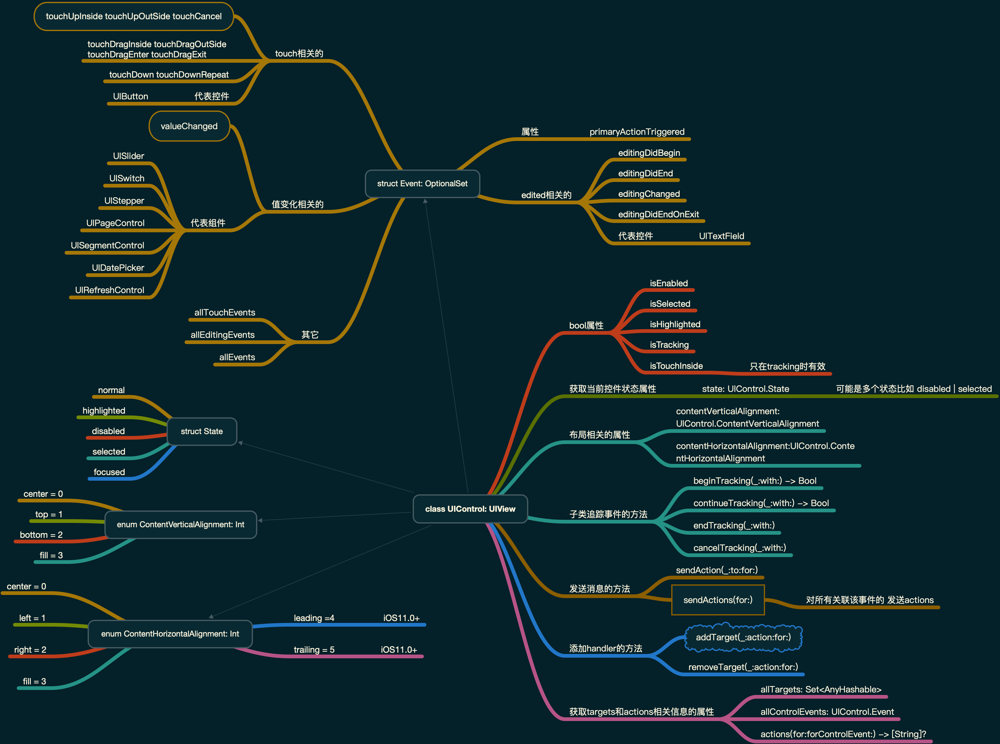

自定义控件示例：

- [CustomControl 如何自定义控件 - github](https://github.com/jamessawyer/learn_ios/blob/master/Book_Programing_iOS13/chapter12%20controllers/CustomControl/CustomControl/MyKnob.swift)
- [How To Make a Custom Control Tutorial: A Reusable Slider - raywenderlich](https://www.raywenderlich.com/7595-how-to-make-a-custom-control-tutorial-a-reusable-slider)


## 1.UISwitch

UISwitch 是一个比较简单的组件，但简单意味功能单一，缺点有：

1. 无法自定义尺寸，只有一个尺寸
2. 没有 **`offTintColor`**

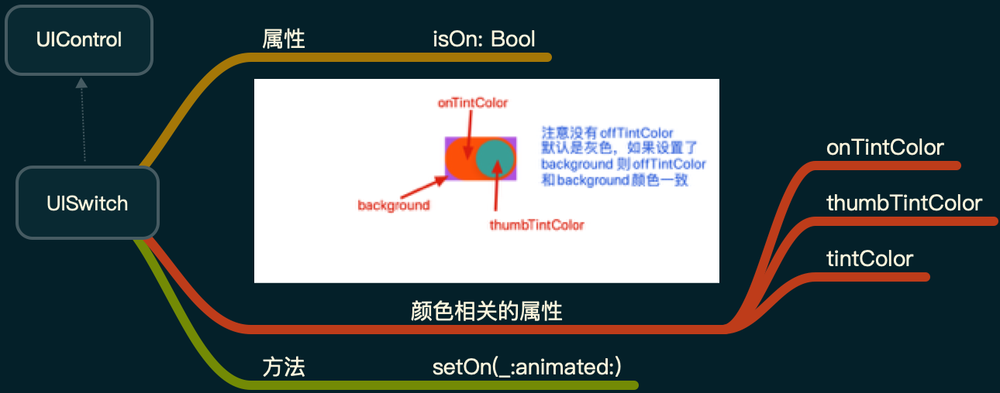

如果想要获取更多自定义功能，可以使用自定义 **`UIControl`** 进行模拟 **`UISwitch`** 行为。比如下图效果：

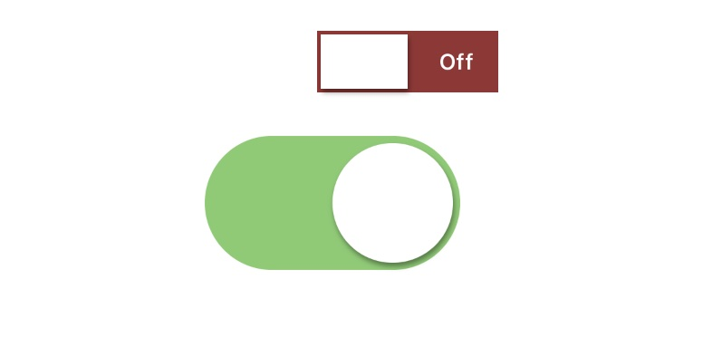

参考：

1. [自定义UISwitch - part1](https://medium.com/@factoryhr/making-custom-uiswitch-part-1-cc3ab9c0b05b)
2. [自定义UISwitch - part2](https://factory.hr/blog/uiswitch-part-2)

GitHub 地址：

- [UISwitchDemo 自定义Switch - github](https://github.com/jamessawyer/learn_ios/blob/master/Book_Programing_iOS13/chapter12%20controllers/UISwitchDemo/UISwitchDemo/CustomSwitch.swift)


## 2.UIStepper

这是一个比较简单的组件，其部分属性和方法如下：

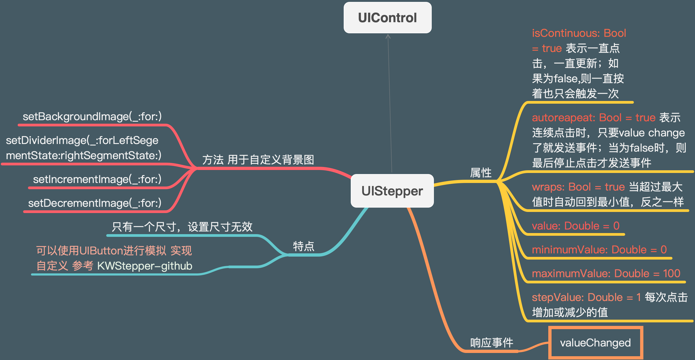

可以使用 **`UIButton`** 去模拟UIStepper的行为，可以参考：

- [KWStepper - github](https://github.com/kyleweiner/KWStepper)


## 3. UIPageControl

这个就是轮播图或者应用引导中常看到的分页小点点了。比如 **`UIScrollView`** 中有个 **`isPagingEnabled`** 属性，可以在页面中添加一个 **`UIPageControl`**, 当滑动的时候，显示当前页面页码；还有 **`UIPageViewController`** 在滚动样式中，也可以添加一个page control，也可以搭配其他组件一起使用。

属性：

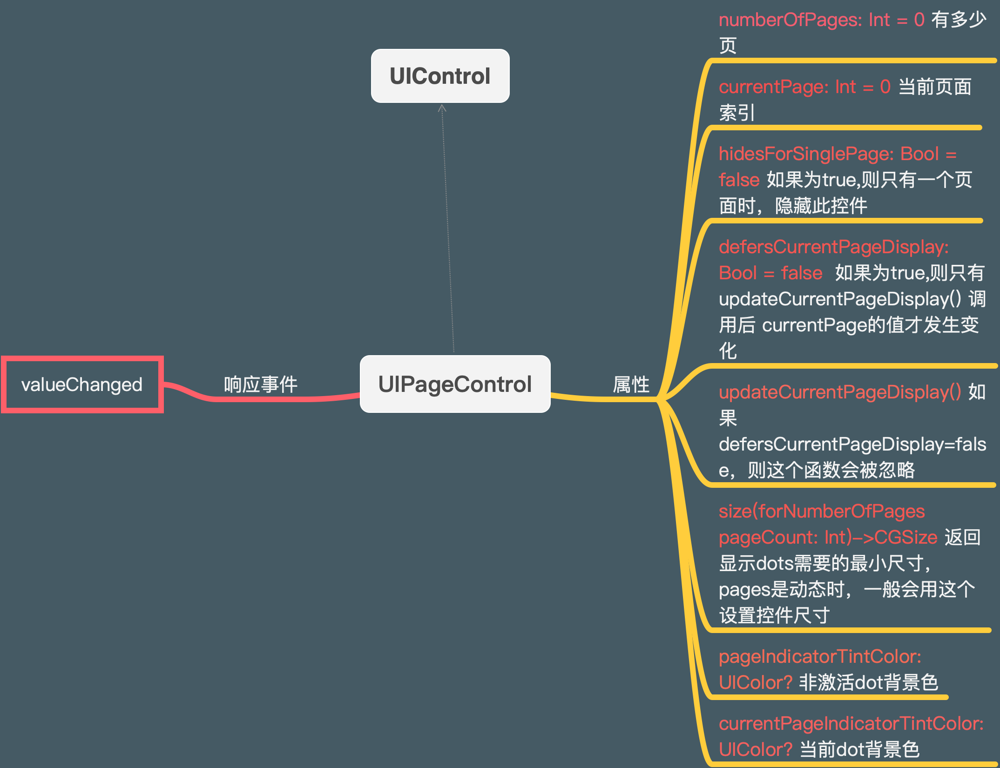

也可以自定义UIPageControl, 将UIPageControl中的小点点，更换为图片的形式：

- [关于UIPageControl自定义样式定制的正确姿势 - CSDN](https://blog.csdn.net/mapboo/article/details/79813383)


## 4. UIDatePicker

这个在iOS的 **时钟** 应用中可以看到，和 **`UIPickerView`** 长的比较像，主要用于选择时间，倒计时时间等

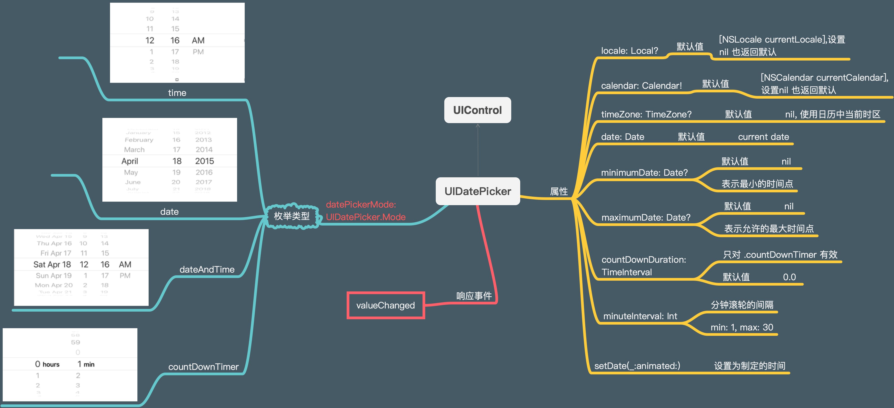


使用：

```swift
let datepicker: UIDatePicker = {
  let dp = UIDatePicker()
  dp.datePickerMode = .date // ---- datePickerMode
  var dc = DateComponents(year: 2018, month: 1, day: 1)
  let c = Calendar(identifier: .gregorian)
  // 最小日期设置为 2018-1-1
  let minDate = c.date(from: dc)!
  dp.minimumDate = minDate // ---- minimumDate
  dc.year = 2020
  let maxDate = c.date(from: dc)! // 即将最大日期设置为 2020-1-1
  dp.maximumDate = maxDate // ---- maximumDate
}()
```

注意事项：

1. 模式为 **`.countDownTimer`** 时，不要设置 **`timeZone`** 属性，可能导致混乱
2. 模式为 **`.countDownTimer`** 时，不要设置 **`maximumDate & minimumDate`** 属性, 可能导致 **`out-of-range`** 崩溃

示例：

- [UIPickerView Demo - github](https://github.com/jamessawyer/learn_ios/blob/master/Book_Programing_iOS13/chapter12%20controllers/UIPickViewDemo/UIPickViewDemo/ViewController.swift)

相关组件：

- [ADDatePicker - iOS Example](https://iosexample.com/a-fully-customizable-ios-horizontal-pickerview-library/)


## 5. UISlider

这个就是一个滑条，主要由以下几个部分组成：

1. **`minimumValueImage`**：可选
2. **`track`** 部分
   1. **`minimumTrack`**
   2. **`maximumTrack`**
3. **`thumb`**： 滑块部分
4. **`maximumValueImage`**： 可选

滑块和轨道以及最大最小值处都可以使用图片。

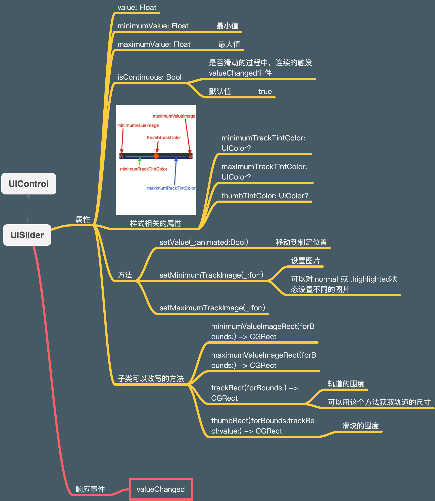

可能会碰到的需求，比如**点击 track 部分，thumb 滑块，滑动到该位置，解决办法，可以给 `UISlider` 添加一个 `UITapGestureRecognizer`, 然后根据点击位置，调用 `setValue` 方法，进行滑动**

```swift
@objc func tapped(_ g: UIGestureRecognizer) {
  let s = g.view as! UISlider
  // 如果isHighlighted为true 表示点击的是thumb滑块区域
  if s.isHighlighted {
    return
  }
  // 点击的点 CGPoint
  let pt = g.location(in: s)
  /// 获取track 的围度信息 CGRect
  let track = s.trackRect(forBounds: s.bounds)
  
  // 如果点击的点不在 轨道区域 则忽略
  if !track.insetBy(dx: 0, dy: -10).contains(pt) {
    return
  }
  
  // 点击位置X轴方向上，占UISlider的百分比位置
  let percentage = pt.x / s.bounds.size.width
  let delta = Float(percentage) * (s.maximumValue - s.minimumValue)
  // 点击位置表示的值
  let value = s.minimumValue + delta
  // 滑动到制定位置
  DispatchQueue.main.asyncAfter(deadline: DispatchTime.now() + 0.1) {
    s.setValue(value, animated: true)
  }
}
```

**有可能有时会碰到，需要在滑块上面，显示当前值的情况，比如:**

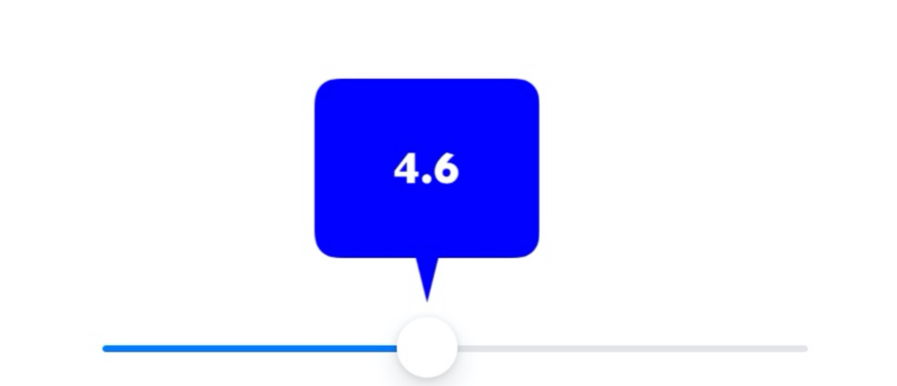

这种情况就需要 **自定义UISlider, 可以：**

1. 继承 **`UISlider`**
2. 使用 **`UIGraphicsImageRenderer`** 绘制自定义浮框
3. 使用UISlider提供的 **thumbRect(forBounds:trackRect:value:)** 来绘制浮框的位置
4. 使用 **`UIControl`** 提供的 **`beginTracking() & contineTracking() & endTracking() & cancelTracking()`** 来追踪事件，更新最新值

可参考：

- [自定义UISliderDemo 继承UISlider - github](https://github.com/jamessawyer/learn_ios/blob/master/Book_Programing_iOS13/chapter12%20controllers/UISliderDemo/UISliderDemo/CustomSlider.swift)

更多自定义 **`UISlider`**:

- [Slider - iOS Example](https://iosexample.com/tag/slider/)


## 6. UISegmentedControl

这个和按钮类似的组件，一般可以和 **`UIScrollView`** 形式类似的tab组件。部分属性和方法：

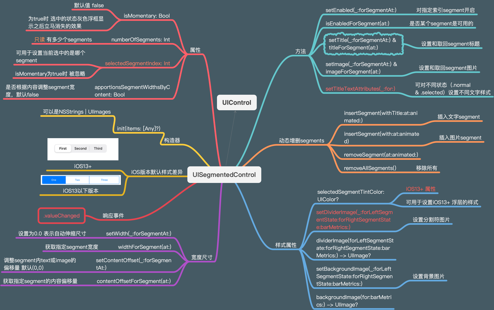

需要注意的点：

1. iOS13+ 和iOS13 以下的默认样式不同，去掉浮层的方式

   ```swift
   // 即把.selected 状态时的背景颜色清除
   if #available(iOS 13.0, *) {
     segmentedControl.selectedSegmentTintColor = .clear
   } else {
     segmentedControl.tintColor = .clear
   }
   ```

2. **`setTitleTextAttributes(_:for:)`** : `for: UIControl.State` 中的状态一般设置 **`.normal & .selected`** 设置不同的属性

   ```swift
   segmentedControl.setTitleTextAttributes([
       NSAttributedString.Key.font: UIFont(name: "DINCondensed-Bold", size: 18)!,
       NSAttributedString.Key.foregroundColor: UIColor.lightGray
   ], for: .normal)
   // 选中时 文字的样式
   segmentedControl.setTitleTextAttributes([
       .font: UIFont(name: "DINCondensed-Bold", size: 18)!,
       .foregroundColor: UIColor.orange
   ], for: .selected)
   ```

3. 去掉分隔符的方法

   ```swift
   segmentedControl.setDividerImage(
     // 设置一个空图片
   	UIImage().withTintColor(.clear),
   	forLeftSegmentState: .normal,
   	rightSegmentState: .normal,
   	barMetrics: .default
   )
   ```

实现类似下图这种效果：

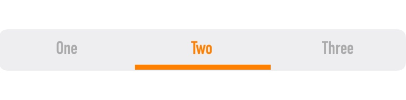

可参考：

- [Designing a Button Bar-Style UISegmentedControl in Swift - 下面的github提供了iOS13版本](https://www.codementor.io/@kevinfarst/designing-a-button-bar-style-uisegmentedcontrol-in-swift-cg6cf0dok)

- [UISegmentedControl playground - github](https://github.com/jamessawyer/learn_ios/blob/master/Book_Programing_iOS13/chapter12%20controllers/CustomUISegmentedControl.playground/Contents.swift)
- [how to change the colors of a segment in iOS13](https://stackoverflow.com/a/56874473)
- [iOS 13 UISegmentedControl: 3 important changes - Medium](https://medium.com/flawless-app-stories/ios-13-uisegmentedcontrol-3-important-changes-d3a94fdd6763)

自定义UISegmentedControl库：

1. [Segmentio - github](https://github.com/Yalantis/Segmentio)
2. [Segment - iOS example](https://iosexample.com/super-customizable-segmented-control-for-ios/)

还可以替换背景图片，此处省略，可参考iOS 13 Programming书中示例


## 7. UIButton

**`UIButton`** 是最常见的一种控件，UIKit默认提供了一下几种形式：

- **title | NSAttributedString**： 文字形式
- **image + title**: 左图标右文字形式
- **image**: 图片按钮

关于 **图片 + title** 形式的按钮的布局，会用到下面属性：

1. **`UIControlContentVerticalAlignment`**: 父类 **`UIControl`** 中定义的属性， 用在 UIButton 上，表示 **image** 和 **title** 竖直方向的对齐方式，可选值为： **`top | bottom | center | fill`**
2. **`UIControlContentHorizontalAlignment`**: 同上，但是是水平方向的对齐方式
3. **`imageEdgeInsets`**：调整 **image** 上下左右边缘离开原来位置的距离
4. **`titleEdgeInsets`**：调整 **title** 上下左右边缘离开原来位置的距离
5. **`contentEdgeInsets`**：调整 **image + title** 整体上下左右边缘离开原来位置的距离, 加padding

具体怎么使用，可以参考：

- [理解UIButton的各种EdgeInsets - 简书](https://www.jianshu.com/p/f0d3ec4b45f3)
- [如何调整 UIButton 中的元素（image 和 title）的布局 - 简书](https://www.jianshu.com/p/4676d84458f7)

下面是UIButton相关的属性：

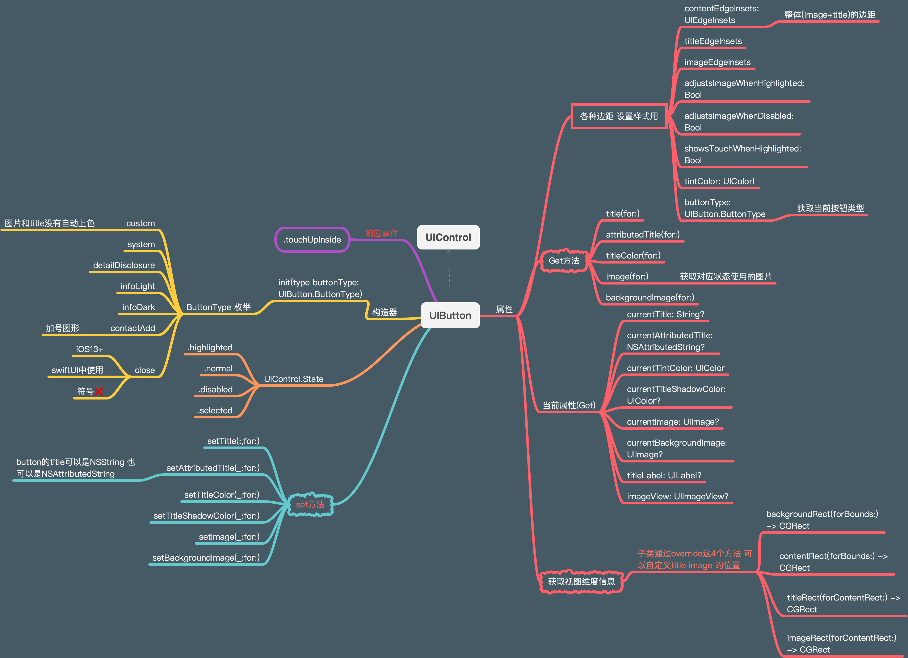

关于子类如何使用 **获取维度信息** 方法对按钮维度进行改写，示例：

```swift
override func backgroundRect(forBounds bounds: CGRect) -> CGRect {
  var result = super.backgroundRect(forBounds: bounds)
  if self.isHighlighted {
  	// 当按钮高亮时 整体尺寸上下左右都缩小3pt
    result = result.insetBy(dx: 3, dy: 3)
  }
  return result
}
```

**另外和大多数UIControl一样，可以在子类中override `intrinsicContentSize` 来改写控件的尺度**

```swift
extension CGSize {
	func withDelta(dw:CGFloat, dh:CGFloat) -> CGSize {
		return CGSize(self.width + dw, self.height + dh)
	}
}

override var intrinsicContentSize: CGSize {
  return super.intrinsicContentSize.withDelta(dw: 25, dh: 20)
}
```

**注意事项：上图中的 `set` 相关的方法，可能会出现动画效果，有时候，我们不需要这种动画效果，可以使用 `UIView.performWithoutAnimation + button.layoutIfNeeded()`**:

```swift
// 假设有2个按钮A和按钮B
// 点击按钮A后使用 setTitle 改变按钮B的文字内容
import UIKit

class ViewController: UIViewController {

		// 按钮B
    @IBOutlet weak var button2: UIButton!
    override func viewDidLoad() {
        super.viewDidLoad()
    }

		// 点击按钮A 改变按钮B的文字内容
    @IBAction func dobutton1(_ sender: Any) {
        let t = NSAttributedString(string: "howdy", attributes: [.foregroundColor: UIColor.red])
        self.button2.setAttributedTitle(t, for: .normal)
        // 取消默认动画效果
        UIView.performWithoutAnimation {
            self.button2.layoutIfNeeded()
        }
    }
}
```

相关文章：

1. [✨使用Core Graphics制作一个带倒角和渐变或者带阴影的按钮 - raywenderlich](https://www.raywenderlich.com/216251-core-graphics-how-to-make-a-glossy-button)
2. [DTGGradientButton - 渐变按钮](https://github.com/tungvoduc/DTGradientButton)
3. [Swift Tool Belt, Part 5: Adding a Gradient UIButton](https://spin.atomicobject.com/2017/12/14/gradient-uibutton-swift/)

图片和文字之间使用上面 **`contentEdgeInsets & titleEdgeInsets & imageEdgeInsets`** 布局：

1. [✨UIButton: Padding Between Image and Text - Noah Gilmore 推荐](https://noahgilmore.com/blog/uibutton-padding/)
