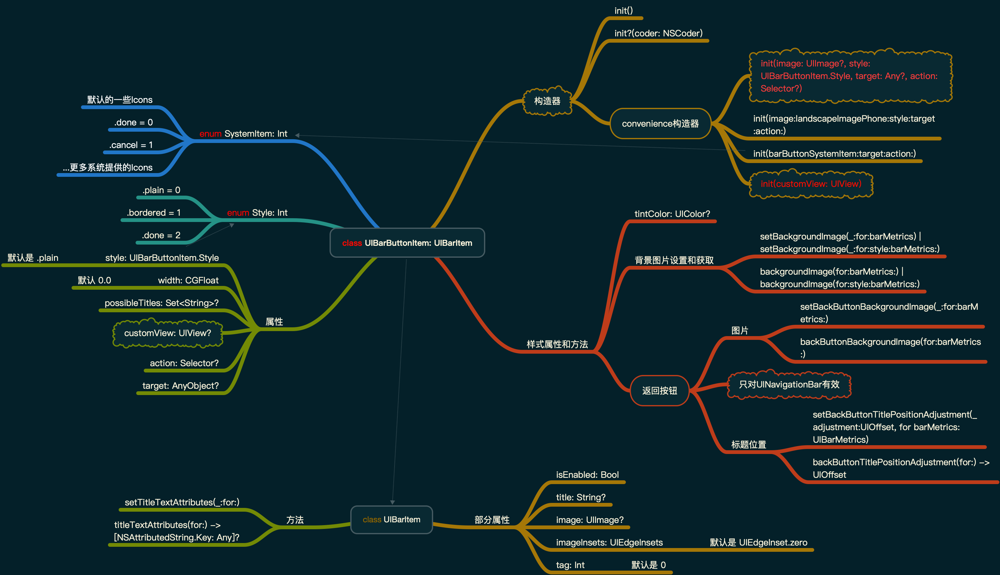
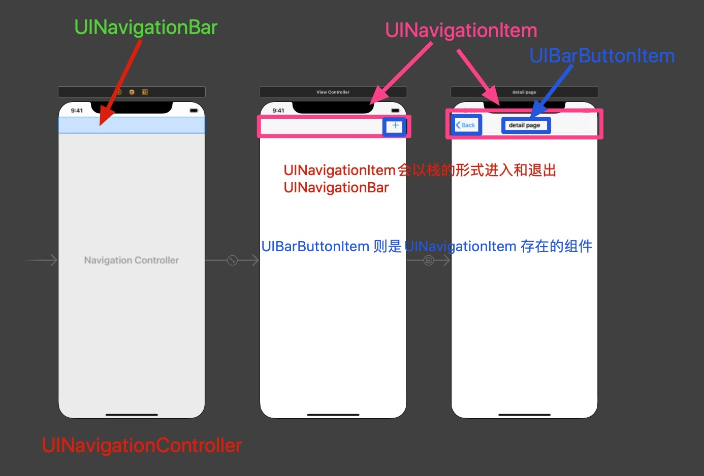
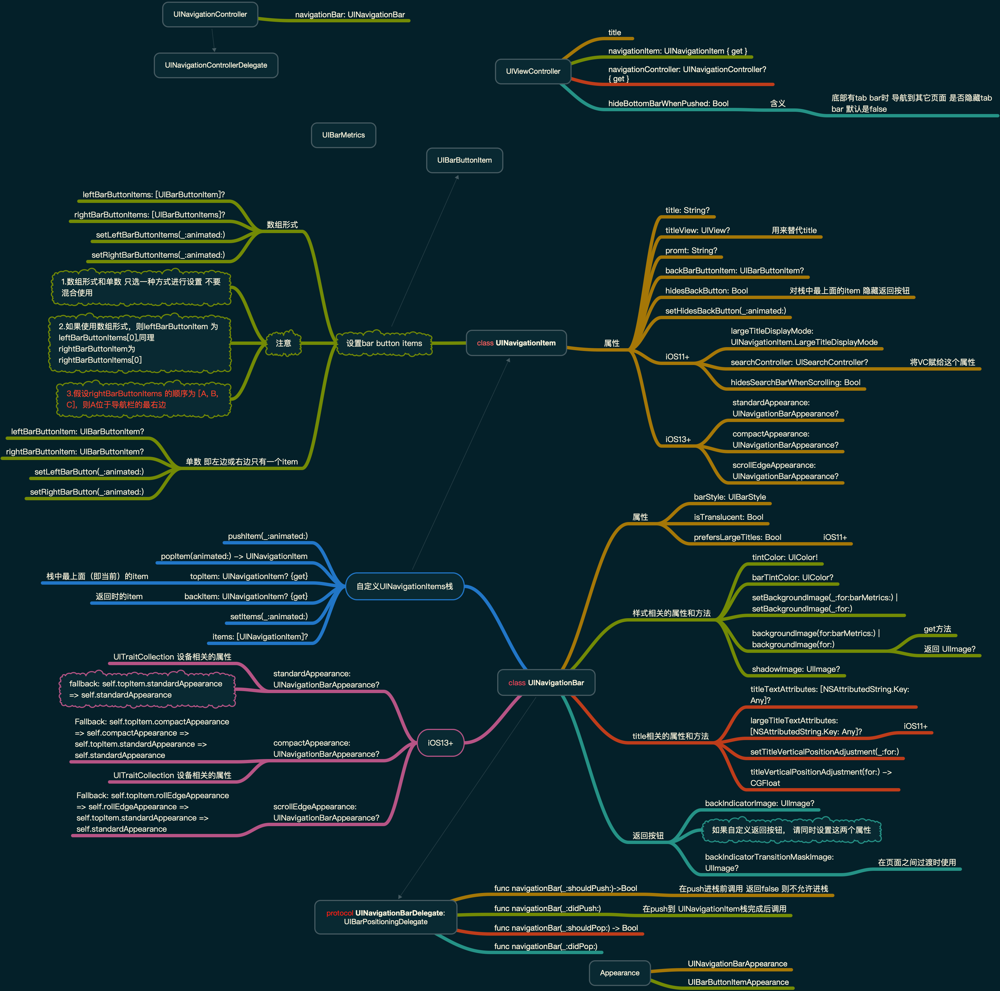
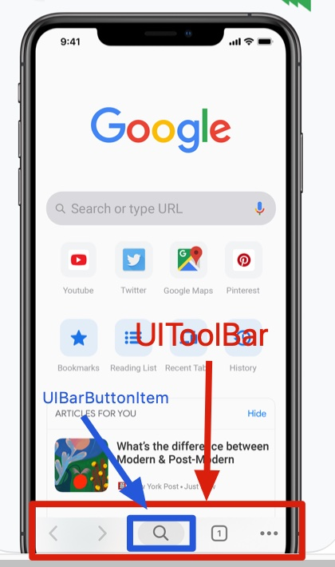
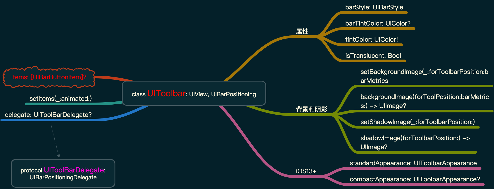
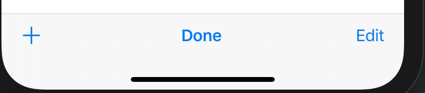
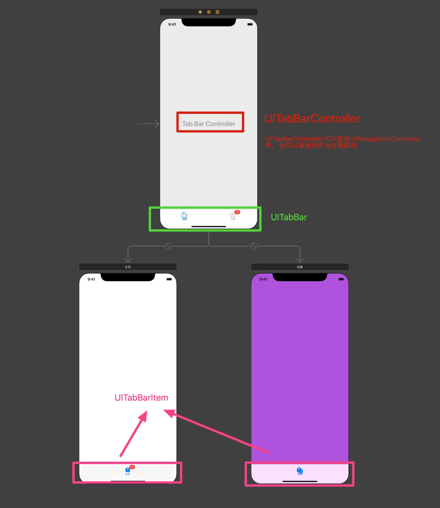
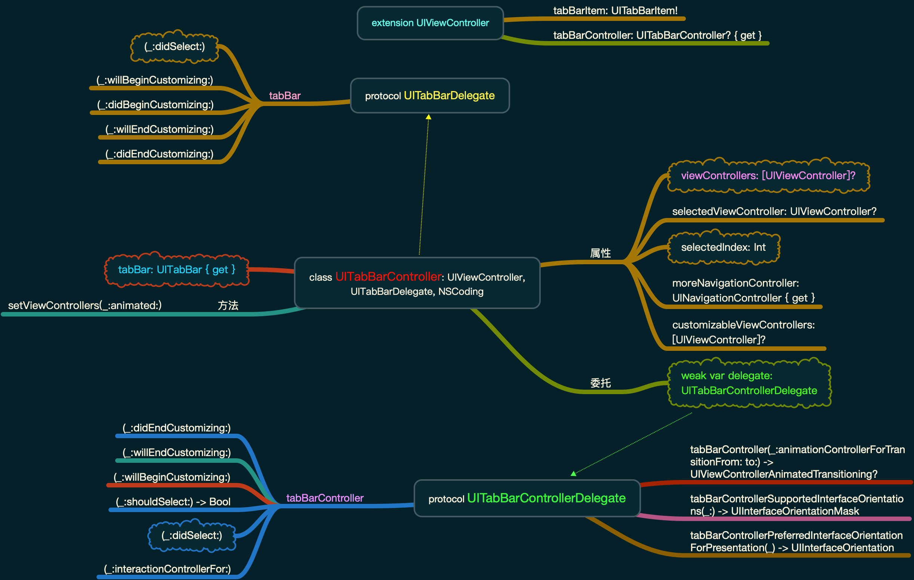
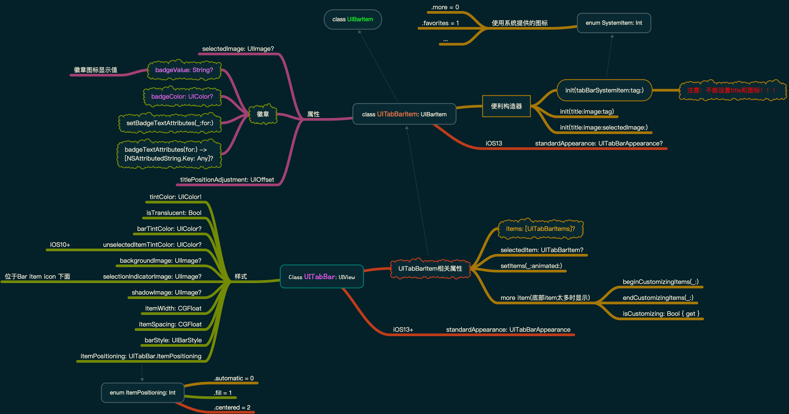

iOS中常见的bars类型有：

1. **`UINavigationBar`**：一般和 **`UINavigationController`** 结合使用，导航条，**在页面的最上面位置**
2. **`UIToolBar`**：工具条，一般用于放置多个 **`UIBarButtonItems`**，可以在页面的**最上面或者最下面**，和 **`UINavigationController`** 结合使用时，位于页面最下面位置
3. **`UITabBar`**：只存在于 **`UITabBarController`** 中，位于 **页面的最下面**

另外2个不在本节讨论范围：

1. **`status bar`**
2. **`search bar`**


## 1.UIBarButtonItem & UIBarItem

添加到 **`bar`** 中的不是 **`view`**, 而是一个 **`UIBarButtonItem`**,其属性如下



设置bar button item标题:

- **`setTitleAttributes(_:for:)`**
- **`setTitlePositionAdjustment(_:for:)`**
- **`setBackButtonTitlePositionAdjustment(:for:)`**

设置bar button item背景：

- **`setBackgroundImage(_:for:barMetrics:)`**
- **`setBackgroundImage(_:for:style:barMetrics:)`**
- **`setBackButtonBackgroundImage(_:for:barMetrics:)`**
- **`setBackgroundVerticalPositionAdjustment(_:for:)`**
- **`setBackButtonBackgroundVerticalPositionAdjustment(_:for:)`**

假设我们希望navigation bar中的所有bar button item 正常状态下白色背景，点击时为黄色背景：

```swift
let bar = self.navigationController!.navigationBar
let r = UIGraphicsImageRenderer(size: CGSize(40,30)
let im = r.image { ctx in
	let con = ctx.cgContext
	con.setFillColor(UIColor.white.cgColor)
	ctx.fill(CGRect(0,0,40,30)
}
// 正常状态 iOS13+
bar.standardAppearance.buttonAppearance.normal.backgroudImage = im

let im2 = r.image { ctx in
	let con = ctx.cgContext
	con.setFillColor(UIColor.yellowlor)
	ctx.fill(CGRect(0,0,40,30)
}
// 点击时 iOS13+
bar.standardAppearance.buttonAppearance.hightlighted.backgroudImage = im

// 假设我们希望返回按钮 正常状态没有背景色 iOS13+
let none = UIImage()
bar.standardAppearance.backButtonAppearance.normal.background = none
```


## 2.UINavigationBar

这个应该是最常见的一种[bar](https://developer.apple.com/design/human-interface-guidelines/ios/bars/navigation-bars/)了， **`UINavigationController`** 中会自带 **`UINavigationBar`**,说到UINavigationBar, **每个页面中会对应一个 `UINavigationItem`**, 所有页面中的UINavigationItem会以 **栈** 的形式存在。

谈到UINavigationBar,会有以下关联类型：

1. **`UINavigationController`**
2. **`UINavigationBar`**: 只有一个，形成 UINavigationItem栈
3. **`UINavigationItem`**：在UINavigationBar栈中的每个页面都存在不同UINavigationItem
4. **`UIBarButtonItem`**：UINavigationItem中，小的组件

他们之间的关系如下：




**UINavigationController** 不在此节讨论的范围,这里知道它有个如图所示的属性：

- **`var navigationBar: UINavigationBar { get }`**

**`ViewController`** 和导航相关的属性有： 

1. **`title: String?`** 可用于设置导航栏的标题
2. **`navigationItem: UINavigationItem { get }`** 当前ViewController中的 **`UINavigationItem`**, 用于设置当前VC导航Item
3. **`navigationContoller: UINavigationController? { get }`**：如果VC放在UINavigationController中，可以用这个属性获取导航控制器
4. **`hidesBottomBarWhenPushed: Bool`**


### 2.1 UINavigationBar 和 UINavigationItem

它们包含的属性和方法，以及2者之间的关系，如下图：



**根据上图我们需要注意：**

1. 设置 **`UINavigationBar`**中的样式或者title相关的属性，是给栈中的每个 **`UINavigationItem`** 设置通用的属性
2. 要想给当前VC设置不同的导航条，则需要设置当前VC中的 **`navigationItem`** 属性
3. **`navigationItem`** 中的属性需要熟悉

示例，假设给当前VC设置一个 **`NSAttributedString`**:

```swift
class DetailViewController: UIViewController {
  override func viewDidLoad() {
    super.viewDidLoad()
    
    var navLabel = UILabel()
    let navTitle = NSMutableAttributedString(
    	string: "Hello",
    	attributes: [
        NSAttributedString.Key.foregroundColor: UIColor.blue,
        NSAttributedString.Key.font: UIFont.systemFont(ofSize: 16, weight: .light)
    	]
    )
    navTitle.append(
      NSMutableAttributedString(
        string: " World",
        attributes: [
          NSAttributedString.Key.foregroundColor: UIColor.red,
          NSAttributedString.Key.font: UIFont.boldSystemFont(ofSize: 18)
        ]
      )
    )
    navLabel.attributedText = navTitle
    // 设置当前VC的navigationItem
    self.navigationItem.titleView = navLabel
  }
}
```

可参考：

- [Swift 4 recipe: Using attributed string in navigation bar title - medium](https://medium.com/@dushyant_db/swift-4-recipe-using-attributed-string-in-navigation-bar-title-39f08f5cdb81)
- [Change Character spacing in navigation bar title swift - stackoverflow](https://stackoverflow.com/questions/31223714/change-character-spacing-in-navigation-bar-title-swift)


### 2.2 UIBarButtonItem & UIBarItem

**`UIBarButtonItem`** 是 **`UINavigationItem`** 中的小的控件，其父类是 **`UIBarItem`**, 包含的属性如下：


示例，比如添加多个 **`UIBarButtonItem`** 到 **`UINavigationItem`** 的 **`rightBarButtonItems`** 中：

```swift
override func viewDidLoad() {
	super.viewDidLoad()
	let editImage = UIImage(named: "edit")
	let searchImage = UIImage(named: "search")
	
	let editButtonItem = UIBarButtonItem(
		image: editImage,
		style: .plain,
		target: self,
		action: #selector("didTapEditButton")
	)
	let searchButtonItem = UIBarButtonItem(
		image: searchImage,
		style: .plain,
		target: self,
		action: #selector("didTapSearchButton")
	)
	
	// 添加到navigationItem中
	// 注意顺序，searchButtonItem 在最右边
	self.navigationItem.rightBarButtonItems = [searchButtonItem, editButtonItem]
}

@objc func didTapEditButton(sender: AnyObject){
    ...
}

@objc func didTapSearchButton(sender: AnyObject){
    ...
}
```

参考：

- [How to add multiple UIBarButtonItems on right side of Navigation Bar? - stackoverflow](https://stackoverflow.com/a/30341493)


## 3.UIToolbar

[UIToolbar](https://developer.apple.com/design/human-interface-guidelines/ios/bars/toolbars/) 和 **`UINavigationItem`** 一样，放着多个 **`UIBarButtonItem`**,  **只能出现在页面的底部** 可以参考google手机版的浏览器



其属性如下：



另外 **`UIViewController`** 中和 **`toolbar`** 相关的属性和方法：

```
extension UIViewController {
  open var toolbarItems: [UIBarButtonItem]?
  open func setToolbarItems(_ toolbarItems: [UIBarButtonItems]?, animated: Bool)
}
```

一般UIToolbar中的 **`[UIBarButtonItem]`** 是依次靠左排列的，如果希望多个items，均匀的分布在UIToolbar上，则可以使用下面方式：

```swift
var bar: UIToolbar = {
  let bar = UIToolbar()
  // 使用 .flexibleSpace 自带的等间距 作为辅助布局
  let flexibleSpace = UIBarButtonItem(barButtonSystemItem: .flexibleSpace, target: nil, action: nil)
  let item1 = UIBarButtonItem(barButtonSystemItem: .add, target: nil, action: nil)
	let item2 = UIBarButtonItem(barButtonSystemItem: .done, target: nil, action: nil)
	let item3 = UIBarButtonItem(barButtonSystemItem: .edit, target: nil, action: nil)
	
	bar.items = [item1, flexibleSpace, item2, flexibleSpace, item3]
	return bar
}()
```

如下图：



可参考：

- [Aligning UIToolbar Items - stackoverflow](https://stackoverflow.com/a/27191249)


## 4. UITabBar

[UITabBar](https://developer.apple.com/design/human-interface-guidelines/ios/bars/tab-bars/) 和 **`UINavigationBar`** 的用法很相似，**`UITabBar`** 一般存在于 **`UITabBarController`** 中，如下图所示结构：



主要涉及的类型有：

1. **`UITabBarController`**: 这是一个 **`UIViewController`**, 可以作为主入口，也可以将其放在 **`UINavigationController`** 中
2. **`UITabBar`**: 形成一个 **`UITabBarItem`** 栈
3. **`UITabBarItem`**: 当前VC中。显示的 TabBarItem

### 4.1 UITabBarController

这个是App中最常见的设计形式，和其有关的API有：

- **`UIViewController`**
- **`UITabBarDelegate`**
- **`UITabBarControllerDelegate`**

如下图所示：




### 4.2 UITabBar & UITabBarItem

类比 **`UINavigationBar & UIBarButtonItem`**，其属性和关系图如下：




注意事项：

- 使用 **`UITabBarItem(tabBarSystemItem:tag:)`** 构建的 tab bar item, 是不能设置自定义图标和标题的，只能使用系统提供的， [How to set title with UITabbarsystemitem - stackoverflow](https://stackoverflow.com/a/16210764)

待解决问题：

- 实际用代码设置UITabBarController时，发现 **`UIBarButtonItem`** 中的 **`title & image`** 很难居中对齐，待解决这个问题

