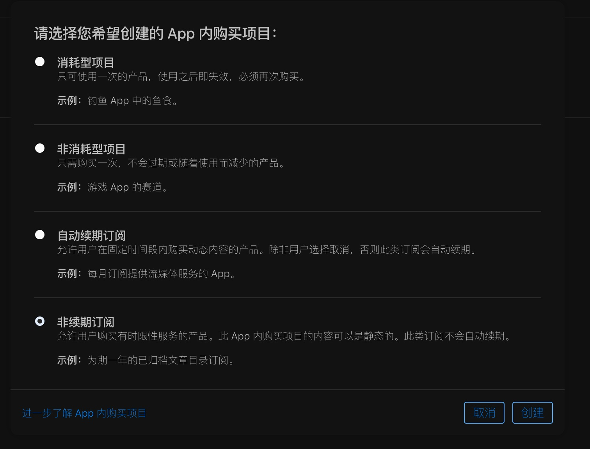
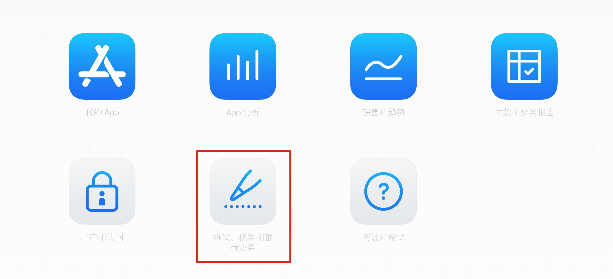
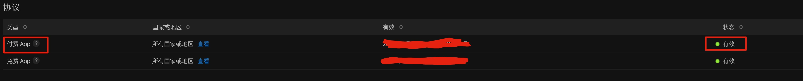
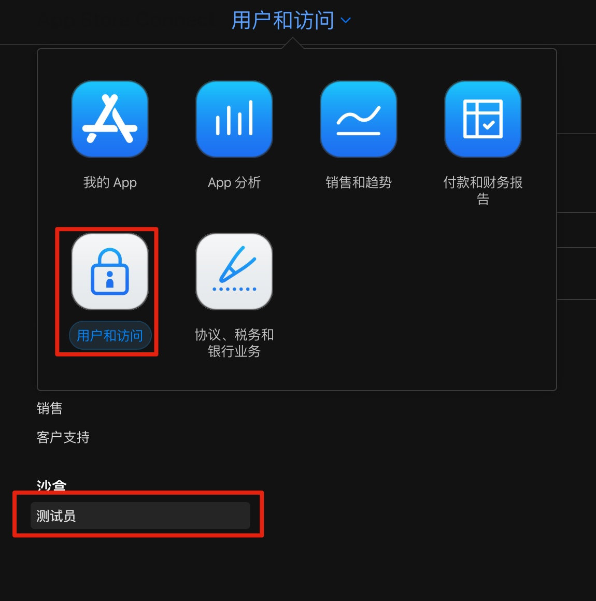
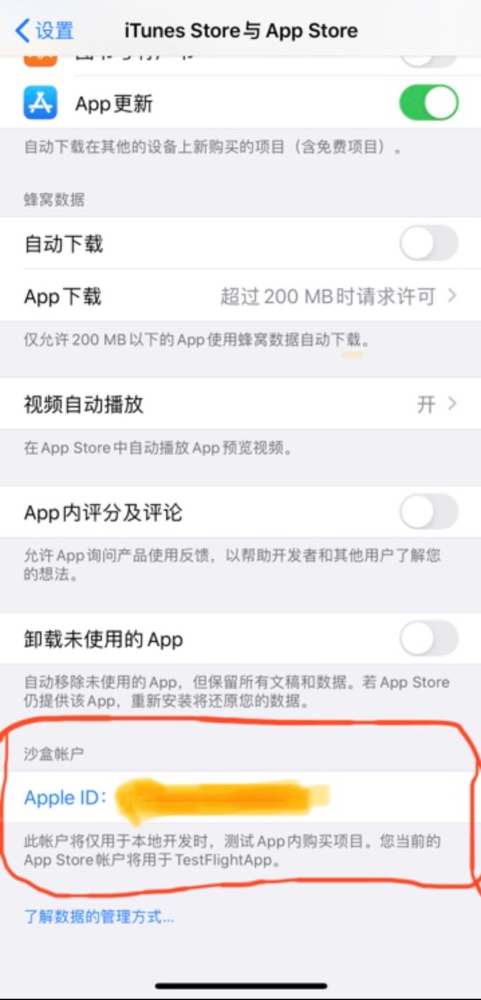
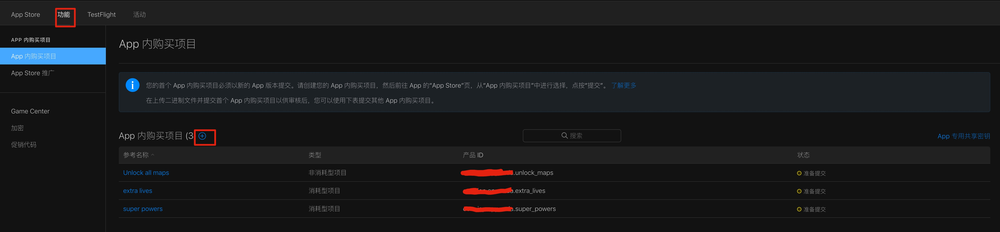
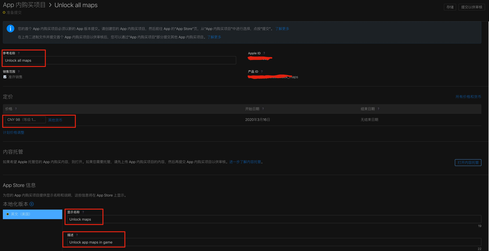
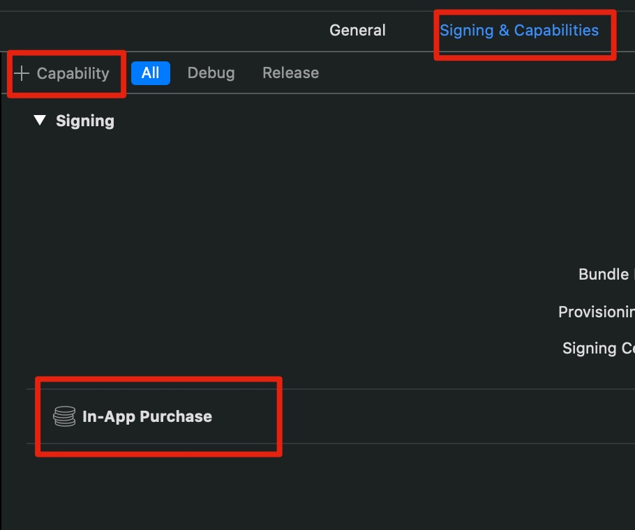

文章来源：

- [A Complete Guide to In-App Purchases for iOS Development - AppCoda](https://www.appcoda.com/in-app-purchases-guide/)


4种IAP 产品：

1. 消耗型（**`Consumable`**）: 使用完后，可以再次购买，比如游戏中的钻石
2. 非消耗型（**`Non-Consumable`**）: 只需要购买一次，不会过期或者随着使用而减少的产品，删除后，也可以通过App Store 进行 **restore**，比如某些游戏中的VIP地图，购买后就是永久的了
3. 自动续期订阅型（**`Auto-renewing subscriptions`**）: 允许用户在固定时间段内购买动态内容产品，除非用户取消，否则此类订阅会自动续期。比如QQ音乐，可以选择每月购买，到期后自动购买下一个月，到期前可以选择取消自动续期
4. 非续期订阅型（**`Non-renewing subscriptions`**）:  允许用户购买有时限性的服务产品，购买项目可以是静态的，此类订阅不会自动的续期。比如某些软件只能一年一年的购买，到期后，需要自己确认购买下一年的。




## 内购基本步骤和注意事项

> 1. 填写 **协议、税务和银行业务**

需要填写 **协议、税务和银行业务** 信息（因为这一条，所以普通开发者，测试内购很麻烦，需要填写一堆信息）



  

当如下图所示 **付费App** 状态为 **有效** 时，表明 **协议、税务和银行业务** 填写成功：




> 2. 添加 **测试员** （**沙盒账号**）

测试IAP需要使用测试员账号



 测试员的账号要使用邮箱，这个邮箱不用验证，因此可以随便写，一定要记住密码，如果忘记了，就只能再添加一个测试员账号了。

**在真机上，设置 -> iTunes Store与App Store -> 沙盒账号 中，输入刚刚添加的测试账号**




> 3. 添加Product Item

在 **我的App** 中，添加需要的内购Item



这里的类型，需要根据产品的性质进行选择，**产品ID**则可以任意填写，和Bundle Identifier一样，需要时唯一的。

下图是，具体的 **SKProduct** Item:



这些填写的信息都可以通过 **`SKProduct`** 实例中的属性获取，比如：

- `price | priceLocal`
- `localizedTitle`
- `localizedDescription`

这个底下有个 **审核信息 -> 截图**， 如果要提交市场审核，就需要将截图上传。


> 4. 开启 **In-App Purchase** 能力

新版的Xcode11,经常把开启的IAP自动关掉，因此需要手动的添加这个




## 使用StoreKit

为了使用IAP,需要使用 **`StoreKit`** framework，下面是通用IAP代码封装：

```swift
import Foundation
import StoreKit

// SKPaymentTransactionObserver 协议 需要其服从的类（IAPManager）同时服从NSObject协议
class IAPManager: NSObject {
  // MARK: - 自定义错误
  enum IAPManagerError: Error {
    case noProductIDsFound    // 找不到product的ids
    case noProductsFound      // app store没返回 IAP products
    case paymentWasCancelled  // 用户取消了购买
    case productRequestFailed // 请求IAP失败，比如网络请求失败
  }
  
  // MARK: - 属性
  var onReceiveProductsHandler: ((Result<[SKProduct], IAPManagerError>) -> Void)?
  var onBuyProductHandler: ((Result<Bool, Error>) -> Void)?
  var totalRestoredPurchases = 0
  
  // MARK: - 单例
  static let shared = IAPManager()
  private override init() {
    super.init()
  }
  
  // MARK: - 通用方法
  // 获取SKProduct ID
  // 可以从网上获取 或者从本地获取
  fileprivate func getProductIDs() -> [String]? {
    // 本示例将所有的IAP ids都存放到本地的 `IAP_ProductsIDs.plist` 文件中 它是一个数组
    guard let url = Bundle.main.url(forResource: "IAP_ProductsIDs", withExtension: "plist") else {
      return nil
    }
    do {
      let data = try Data(contentOf: url)
      let productIDs = try PropertyListSerialization.propertyList(
        from: data,
        options: .mutableContainersAndLeaves,
        format: nil
      ) as? [String] ?? []
      return productIDs
    } catch {
      print(error.localizedDescription)
      return nil
    }
  }
  
  // 对产品价格进行格式化
  func getPriceFormatted(for product: SKProduct) -> String? {
    let formatter = NumberFormatter()
    formatter.numberStyle = .currency
    formatter.locale = product.priceLocale
    return formatter.string(from: product.price)
  }
  
  // MARK: - GET IAP Products
  // 从App Store获取所有的 SKProduct
  func getProducts(withHandler productsReceiveHandler: @escaping (_ result: Result<[SKProduct], IAPManagerError>) -> Void) {
    // Keep the handler (closure) that will be called when requesting for
    // products on the App Store is finished.
    onReceiveProductsHandler = productsReceiveHandler
    
    guard let productIDs = getProductIDs() else {
      // 没找到IDs
      productsReceiveHandler(.failure(.noProductIDsFound))
      return
    }
    
    // 初始化请求product
    let request = SKProductsRequest(productIdentifiers: Set(productIDs))
    request.delegate = self
    
    // 开始请求
    request.start()
  }
  
  // MARK - Observing the payment queue
  // 需要对IAP队列进行监听
  func startObserving() {
    SKPaymentQueue.default().add(self)
  }
  func stopObserving() {
    SKPaymentQueue.default().remove(self)
  }
  // 检测该设备是否允许IAP,因为在系统设置中是可以关闭IAP的（避免小孩误购买）
  func canMakePayments() -> Bool {
    return SKPaymentQueue.canMakePayments()
  }
  
  // MARK: - Purchase Products
  func buy(product: SKProduct, withHandler handler: @escaping ((_ result: Result<Bool, Error>) -> Void)) {
    let payment = SKPayment(product: product)
    SKPaymentQueue.default().add(payment)
    
    // Keep the completion handler.
    onBuyProductHandler = handler
  }
  
  // MARK: - Restore Products for Non-consumable product
  func restorePurchases(withHandler handler: @escaping ((_ result: Result<Bool, Error>) -> Void)) {
    onBuyProductHandler = handler
    totalRestoredPurchases = 0
    
    // restoreCompletedTransactions 用于恢复先前购买的non-consumable product
    SKPaymentQueue.default().restoreCompletedTransactions()
  }
}

extension IAPManager: SKProductsRequestDelegate {
  func productsRequest(_ request: SKProductsRequest, didReceive response: SKProductsResponse) {
    // Get the available products contained in the response.
    let products = response.products
    // invalidProductIdentifiers 表示无效的ids
    // response.invalidProductIdentifiers
    print("invalidProductIdentifiers: \(response.invalidProductIdentifiers)")
    
    // Check if there are any products available.
    if products.count > 0 {
      // Call the following handler passing the received products.
      onReceiveProductsHandler?(.success(products))
    } else {
     	// No products were found.
      onReceiveProductsHandler?(.failure(.noProductsFound))
    }
  }
  
  // 如果请求发生了任何错误
  func request(_ request: SKRequest, didFailWithError error: Error) {
    onReceiveProductsHandler?(.failure(.productRequestFailed))
  }
  
  // 请求完成
  func requestDidFinish(_ request: SKRequest) {
    // Implement this method OPTIONALLY and add any custom logic
    // you want to apply when a product request is finished.
  }
}

extension IAPManager: SKPaymentTransactionObserver {
  func paymentQueue(_ queue: SKPaymentQueue, updatedTransactions transactions: [SKPaymentTransaction]) {
    transactions.forEach { (transaction) in
    	switch transaction.transactionState {
        case .purchased:
        	onBuyProductHandler?(.success(true))
        	// finishTransaction 用于标记payment queue完成了
        	SKPaymentQueue.default().finishTransaction(transaction)
        case .restored:
         	totalRestoredPurchases += 1
         	SKPaymentQueue.default().finishTransaction(transaction)
        case .failed:
        	if let error = transaction.error as? SKError {
            if error.code != .paymentCancelled {
              onBuyProductHandler?(.failure(error))
            } else {
            	onBuyProductHandler?(.failure(IAPManagerError.paymentWasCancelled))
        		}
        		print("IAP error:", error.localizedDescription)
        	}
        	SKPaymentQueue.default().finishTransaction(transaction)
        	
        case .deferred, .purchasing: break
        @unknown default: break
    	}
    }
  }
  
  func paymentQueueRestoreCompletedTransactionsFinished(_ queue: SKPaymentQueue) {
    if totalRestoredPurchases != 0 {
      onBuyProductHandler?(.success(true))
    } else {
      print("IAP: No purchases to restore!")
      onBuyProductHandler?(.success(false))
    }
  }
  
  func paymentQueue(_ queue: SKPaymentQueue, restoreCompletedTransactionsFailedWithError error: Error) {
    if let error = error as? SKError {
      if error.code != .paymentCancelled {
        print("IAP Restore Error:", error.localizedDescription)
        onBuyProductHandler?(.failure(error))
      }
    } else {
      onBuyProductHandler?(.failure(IAPManagerError.paymentWasCancelled))
    }
  }
}

extension IAPManager.IAPManagerError: LocalizedError {
  var errorDescription: String? {
		switch self {
    case .noProductIDsFound: return "No IN-App Purchase product ids were found"
    case .noProductsFound: return "No In-App Purchases were found."
    case .productRequestFailed: return "Unable to fetch available In-App Purchase products at the moment"
    case .paymentWasCancelled: return "In-App Purchase process was cancelled"
		}
  }
}
```

在 **`AppDelegate.swift`** 中开启监听：

```swift
// 应用启动时 开启监听
func application(_ application: UIApplication, didFinishLaunchingWithOptions launchOptions: [UIApplication.LaunchOptionsKey: Any]?) -> Bool {
  IAPManager.shared.startObserving()
  return true
}

// 应用终止时移除监听
func applicationWillTerminate(_ application: UIApplication) {
  IAPManager.shared.stopObserving()
}
```


**购买某个Product**

```swift
func purchase(product: SKProduct) -> Bool {
	// 先检查能否进行IAP
  if !IAPManager.shared.canMakePayments {
    return false
  } else {
    delegate?.willStartLongProcess() // 界面添加loading指示器
    
    IAPManager.shared.buy(product: product) { (result) in
    	DispatchQueue.main.async {
        self.delegate?.didFinishLongProcess() // 请求app store 服务器完成
        
        switch result {
        // 购买成功
        case .success(_): self.updateGameDataWithPurchasedProduct(product)
        // 购买失败
        case .failure(let error): self.delegate?.showIAPRelatedError(error)
        }
    	}
    }
  }
}
```


**恢复某个Non-consumable product**:

```swift
func restorePurchases() {
  delegate?.willStartLongProcess()
  
  IAPManager.shared.restorePurchases { (result) in
  	self.delegate?.didFinishLongProcess()
  	
  	switch result {
    case .success(let success):
    	if success {
    	  // 如果存在需要恢复的商品
        self.restoreUnlockedMaps()
        self.delegate?.didFinishRestoringPurchasedProducts()
    	} else {
    		// 不存在需要恢复的商品
        self.delegate?.didFinishRestoringPurchasesWithZeroProducts()
    	}
    case .failure(let error):
    	self.delegate?.showIAPRelatedError(error)
  	}
  }
}
```


这篇文章对IAP的流程基本上都提及到了，但是只有 **消耗型和非消耗型** 2种产品类型，对于 **自动续期订阅型 和 非续期订阅型** 没有提到。

对于其它的类型，可以参考以下文章：

1. [In-App Purchase Tutorial: Getting Started - raywenderlich](https://www.raywenderlich.com/5456-in-app-purchase-tutorial-getting-started)
2. [In-App Purchase Tutorial: Auto-Renewable Subscriptions  - raywenderlich](https://www.raywenderlich.com/1458378-in-app-purchase-tutorial-auto-renewable-subscriptions) 自动续期订阅型
3. [In-App Purchases: Receipt Validation Tutorial - raywenderlich](https://www.raywenderlich.com/9257-in-app-purchases-receipt-validation-tutorial) 订单验证
4. [In-App Purchases: Non-Renewing Subscriptions Tutorial](https://www.raywenderlich.com/754-in-app-purchases-non-renewing-subscriptions-tutorial) 非续期订阅型

上面文章暂时未进行学习，待以后真正需要时，再进行深入了解。

 